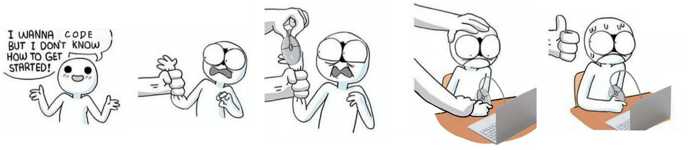

# Roadmap Data Science

**\>\> CONTEUDO PRELIMINAR EM FASE DE COLETA DE INFORMAÇÕES <<**

O intuito deste arquivo é servir como um guia para auxiliar seus estudos em Data Science!

Montei aqui um compilado baseado em diversas fontes além é claro da minha experiencia. 

## Referências

#### Roadmaps e Links úteis

- [MrMimic data scientist roadmap](https://github.com/MrMimic/data-scientist-roadmap)

- [Towards Data Science Roadmap for 2021](https://towardsdatascience.com/data-science-learning-roadmap-for-2021-84f2ba09a44f)

- [ArtisOne Data Science Roadmap](https://medium.com/@ArtisOne/data-science-roadmap-2020-b256fb948404)

- [Alura Tech Guide - Trilha Data Scientist](https://techguide.sh/pt-BR/path/data-scientist/)

- [USP ICMC - Bacharelado em Ciência de Dados](https://uspdigital.usp.br/jupiterweb/listarGradeCurricular?codcg=55&codcur=55090&codhab=0&tipo=N)

- [USP ICMC - Bacharelado em Estatística e Ciência de Dados](https://uspdigital.usp.br/jupiterweb/listarGradeCurricular?codcg=55&codcur=55071&codhab=4&tipo=N)

- [USP IME - Bacharelado Estatística](https://uspdigital.usp.br/jupiterweb/listarGradeCurricular?codcg=45&codcur=45062&codhab=1&tipo=N)

- [CEDS ITA 2022](https://ceds.ita.br/turma/ibape-pr/#carga-hor%C3%A1ria-e-disciplinas)

- [Google Machine Learning Education](https://developers.google.com/machine-learning)

- [Marcos Silva - Como se tornar um cientista de dados](https://medium.com/team-data-stone/como-se-tornar-um-cientista-de-dados-bdda45047be1)

- [QUODA - Trilha em Ciência de Dados](https://twitter.com/qodabr/status/1337765125621764098)

- [sn3fru - Data Science Course](https://github.com/sn3fru/datascience_course)

- [Learn Python, Data Viz, Pandas &amp; More | Tutorials | Kaggle](https://www.kaggle.com/learn)

- [Introdução ao TensorFlow](https://www.tensorflow.org/learn)

- [Educação em machine learning &nbsp;|&nbsp; TensorFlow](https://www.tensorflow.org/resources/learn-ml)

- [Geeks for Geeks - How to Become Data Scientist](https://www.geeksforgeeks.org/how-to-become-data-scientist-a-complete-roadmap/)

- [IBAPE - Curso de especializacao em Data Science CEDS](https://www.ibapepr.org.br/curso-de-especializacao-em-data-science-ceds/)

- [A realidade por trás do Data Science e dos Unicórnios](https://medium.com/data-hackers/a-realidade-por-tr%C3%A1s-do-data-science-e-dos-unic%C3%B3rnios-4d947538f104)

- [Pesquisa Google Trilha Data Science](https://www.google.com/search?q=trilha+data+science&newwindow=1&source=lnms&tbm=isch&sa=X&ved=2ahUKEwi3i4i1oLr4AhXIJ7kGHWZ0CwIQ_AUoAXoECAEQAw&biw=1920&bih=947#imgrc=Qc4tZToHVK4DAM)

- [CIÊNCIA DE DADOS COM LINGUAGEM R](https://zheage.github.io/Aulas-Ciencia-de-Dados-com-R/introdu%C3%A7%C3%A3o.html)

- [Need Help Getting Started with Applied Machine Learning?](https://machinelearningmastery.com/start-here/) (Abordagem top-down)

- [Data Science Academy - Cursos Gratuitos](https://www.datascienceacademy.com.br/cursosgratuitos)

- [Darthmouth - Introdução a Probabilidade](https://math.dartmouth.edu/~prob/prob/prob.pdf) (Ivy League, o melhor material sobre o assunto que encontrei até hoje)

- [Microsoft Data Science for Beginners](https://microsoft.github.io/Data-Science-For-Beginners/#/)

#### Livros e artigos

- [Hands-On Machine Learning with Scikit-Learn, Keras, and TensorFlow, 2nd Edition [Book]](https://www.oreilly.com/library/view/hands-on-machine-learning/9781492032632/)

- [Practical Statistics for Data Scientists, 2nd Edition [Book]](https://www.oreilly.com/library/view/practical-statistics-for/9781492072935/)

- [R for Data Science [Book]](https://www.oreilly.com/library/view/r-for-data/9781491910382/)

- [Python for Data Analysis, 2nd Edition [Book]](https://www.oreilly.com/library/view/python-for-data/9781491957653/)

- [Storytelling with data: A data visualization Guide for Business Professionals](https://www.wiley.com/en-us/Storytelling+with+Data:+A+Data+Visualization+Guide+for+Business+Professionals-p-9781119002253)

- [Python Data Science Handbook [Book]](https://www.oreilly.com/library/view/python-data-science/9781491912126/)

- [GitHub - jakevdp/PythonDataScienceHandbook: Python Data Science Handbook: full text in Jupyter Notebooks](https://github.com/jakevdp/PythonDataScienceHandbook)

- [An Introduction to Statistical Learning | SpringerLink](https://link.springer.com/book/10.1007/978-1-4614-7138-7)

- [Introduction to Machine Learning with Python [Book]](https://www.oreilly.com/library/view/introduction-to-machine/9781449369880/)

- [Entropia, Ganho de informação e Decision trees](http://www.esalq.usp.br/lepse/imgs/conteudo_thumb/Entropia--Ganho-de-informa--o-e-Decision-trees.pdf)

- [The Machine Learning Mastery Learning](https://machinelearningmastery.com/machine-learning-mastery-method/)

- [Algoritmos de destruição em massa](https://www.amazon.com.br/Algoritmos-Destrui%C3%A7%C3%A3o-Massa-Cathy-ONeil/dp/6586460026/ref=asc_df_6586460026/)

#### Canais

- [freeCodeCamp.org - YouTube](https://www.youtube.com/c/Freecodecamp)

- [Data Science Dojo - YouTube](https://www.youtube.com/c/Datasciencedojo)

- [Data Science for beginners full course part 1 - YouTube (University of Washington)](https://www.youtube.com/watch?v=xUJ170KJIfM)

- [StatQuest with Josh Starmer - YouTube](https://www.youtube.com/c/joshstarmer)

- [What is Pandas?](https://www.youtube.com/watch?v=yzIMircGU5I&list=PL5-da3qGB5ICCsgW1MxlZ0Hq8LL5U3u9y)
  
- [Como você é uma cobaia da internet](https://www.youtube.com/watch?v=hTjY6DToAXc)

- [Não seja ambicioso](https://www.youtube.com/watch?v=BBnDapwb2Ck) (ótima filosofia pra não ir com muita sede ao pote)

- [Como usam a psicologia para fisgar jogadores](https://www.youtube.com/watch?v=WQXK6ejnwyY)

- [Ela se Tornou Cientista de Dados em Apenas 6 Meses](https://www.youtube.com/watch?v=RpRoBWbyTIs)

#### Documentações

- [Choosing the right estimator &mdash; scikit-learn 1.1.2 documentation](https://scikit-learn.org/stable/tutorial/machine_learning_map/index.html)

- [Roadmap &mdash; scikit-learn 1.1.2 documentation](https://scikit-learn.org/stable/roadmap.html)

#### Minhas Considerações

> [VER NA INTEGRA](https://discord.com/channels/789888698673922078/836579931159789598/1003371079210909707)
> 
> Acho que uma dica seria: **não procure a melhor forma de começar, só comece**. Se ficar nessa de buscar a melhor, você nunca vai começar.
> 
> Eu buscaria coisas em paralelo como estatísticas, distribuições, regressões, um pouco de matemática, dados e depois os algoritmos de Machine Learning. Ciência de Dados é uma mistura de muita coisa, não acho que tenha um ponto de partida único. Conheço um canal que Chama StatQuest que explica de forma bem visual, didática e mastigada os conceitos. O importante é nunca parar de buscar e aprender
> 
> A USP tem a grade de todos os cursos abertos, vai ter MUITO conteúdo que parece assustar, mas é uma boa forma de balizar o início dessa jornada (ver links acima)
> 
> Tem bastante coisa ai que não é estritamente necessário pra começar, mas por se tratar de um curso de graduação eles vão te dar todas as bases necessárias. Com um pouco de cuidado e bom discernimento você consegue ir selecionando pontos específicos e ir aprendendo no seu ritmo

> [VER NA INTEGRA](https://discord.com/channels/789888698673922078/836579931159789598/1013919303608848395)
> 
> Em relação a matemática, ciência de dados é muito baseado em: Estatística / Sistemas lineares, Álgebra linear, regressão linear.
> Não existe um caminho único, um melhor caminho...
> 
> O que eu fiz pra aprender: Fucei em tudo que conseguia, criava modelos, aprendia bibliotecas, lia documentações e páginas que explicavam técnicas e coisas mais profundas...
> 
> Python é a maior fonte de recurso quando se trata de ciência de dados, porém nada impede de estudar outras linguagens como R por exemplo. (Eu aprendi usando C#)
> 
> O complicado de ciência de dados é que é uma área MUITO abrangente e nem todo mundo entende a mesma coisa. Tem gente que acha que é criar modelos estatísticos e tem gente que acha que é tratamento de dados, outros ja dizem que é machine learning... existe uma mistura ai no meio e também outras vertentes que se misturam com outros assuntos (como econometria)
> 
> existem trilhas (ver links acima) mas eu não gosto muito de recomentar pois acaba dando a impressão de que você TEM QUE começar no passo 1, depois passo 2 e acaba assustando por ter várias coisas de complexidades diferentes com nome estranho.... você pode pegar qualquer item dessa lista e aprender de forma isolada e depois juntar os conhecimentos mais pra frente.
> 
> Você pode sim começar pela matemática, mas o assunto acaba sendo BEM denso e as vezes não te da o retorno imediato de que esta aprendendo pois a aplicação é bem difícil
> 
> Os vídeos ensinam e falam das bibliotecas pois é a parte legal, é onde todo mundo quer estar: apertar o botão fit() e treinar o modelo
> 
> a matámatica te diz o motivo e o que está acontecendo, mas acaba sendo a parte difícil
> 
> e os vídeos tem que fazer visualização certo? por isso "só mostram o bolo e nao a receita"
> 
> e por não ter um ponto de partida bem definido, acaba sendo difícil recomendar por onde começar a estudar ciência de dados
> 
> no fim das contas é uma mistura de matemática, estatística, programação, banco de dados, algoritmos, visualização e negócios (a área que você aplica tudo isso, finanças, engenharia, biologia, psicologia....)
> 
> por exemplo, redes neurais usa MUITO sistemas lineares, matrizes, derivadas e gradientes
> 
> Regressões o nome propriamente diz, usa muito regressão linear, gradientes também, estatística multivariada, correlações e variância
> 
> Arvores/forests usam muito entropia, algoritmos dicotomizadores
> 
> Acho que a melhor forma de começar é ter curiosidade e vontade de aprender TUDO porém com calma porque é muita coisa MESMO, é uma junção de várias áreas do conhecimento
> 
> e aprender matemática pura de forma bruta pode não ser legal no começo, pois você raramente vai codar as equações, mas é importante saber o que elas fazem e como os algoritmos funcionam debaixo do capô.

> [VER NA INTEGRA](https://discord.com/channels/789888698673922078/836579931159789598/1013919303608848395)
> 
>É uma área ou profissão bem ampla, não existe uma definição exata, mas dá pra dar alguns exemplos
> 
>Da experiencia que eu tive com Ciência de Dados, no setor financeiro. Usa bastante estatística, habilidades e manipular dados e principalmente o conhecimento de negócio que é basicamente saber o motivo pelo qual você está fazendo tal coisa e como isso impacta o resto da cadeia de trabalho. 50% do tempo era discussão de negócios pra entender as necessidades, 40% tratando dados 9% validando estatisticamente e só 1% fazendo a parte divertida que é usar os modelos de Machine Learning e IA. Não usamos diretamente o conhecimento de Álgebra Linear, SGD, Equações Diferenciais... mas é importante ter tudo isso na cabeça pra entender os motivos de algo ter dado certo ou errado, ou parecer estar certo mas conceitualmente errado... Por mais que não escrevemos os algoritmos, é importante saber o que eles fazem debaixo do capô. Usamos muito SQL, dados, otimização, tratamento e limpeza, aplicação de conceito, engenharia de variáveis....
> 
>Outras áreas como desenvolvimento de chatbots podem pegar um pouco mais pro lado técnico/estatístico puro sem tanto depender de negócios. Desenvolvimento de NPL requer conhecimentos de lingüística, tratamento de dados esparsos... Áreas da engenharia podem requerer conhecimentos de mercado, consumo ou específicos da aplicação (vibro-acústica por exemplo)
> 
>É uma área nova e bem ampla e geralmente o aprendizado é focado em um "setor" ou aplicação específica, no caso da financeira acaba tendo bastante paralelos com Econometria. No caso de visão/acústica computacional tem muito paralelo com processamento de sinais; NLP com estruturas lingüísticas, semântica... E assim vai
> 
>Até dá pra falar que existe um "pacote básico" de aprendizado, mas você vai aprender mesmo aplicando e entendendo aos poucos, num trabalho ou aplicação real, onde você não avalia as métricas (Gini, ROIC, KS, RMS....) e sim os resultados e impactos da aplicação do modelo ou conhecimento (Redução de custo, tempo de fila/espera, redução de perdas, aumento no lucro com redução de risco, chatbots responsivos, recomendações mais certeiras....)
> 
> 
